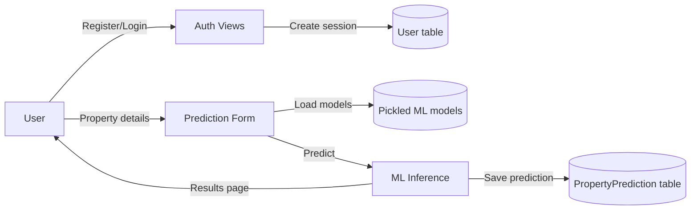

# ML Property Price Predictor (Django)

A Django web app for a real-estate brokerage to register users, collect property details, and predict prices using multiple pre-trained ML models. Predictions are shown per model and stored for later analysis.

## Highlights
- Multi-model inference (XGBoost, LGBM, Random Forest, Decision Tree, Linear Regression, SVR)
- Custom login/registration with session-based access control
- Feature-driven form UI with numeric, categorical, and text inputs
- Prediction history stored in the database
- Production-ready settings for Azure App Service + PostgreSQL

## Data Flow Diagram (DFD)


## Project Structure (Text Snapshot)
```
.
├─ authenticate_user/
│  ├─ templates/
│  │  ├─ landing.html
│  │  ├─ login.html
│  │  └─ register.html
│  ├─ models.py
│  ├─ urls.py
│  └─ views.py
├─ ml_predictor/
│  ├─ models/
│  │  ├─ xgb_model_tree.pkl
│  │  ├─ DecisionTreeRegressor_tree.pkl
│  │  ├─ LGBMRegressor.pkl
│  │  ├─ RandomForestRegressor_tree.pkl
│  │  ├─ LinearRegression.pkl
│  │  └─ SupportVectorRegressor.pkl
│  ├─ templates/
│  │  └─ ml_predictor/
│  │     ├─ home.html
│  │     └─ result.html
│  ├─ models.py
│  ├─ urls.py
│  └─ views.py
├─ ml_model_deploy/
│  ├─ settings.py
│  ├─ deployment.py
│  └─ urls.py
├─ static/
│  └─ style.css
├─ db.sqlite3
├─ manage.py
└─ requirements.txt
```

## Features
- Landing page for the brokerage brand
- Register and login flows with sessions
- Protected predictor form for authenticated users
- Manual one-hot encoding to match training features
- Multi-model price predictions with formatted output
- Predictions saved to `PropertyPrediction` for analytics

## Use Cases
- A broker logs in and estimates the value of a property listing
- A sales analyst compares outputs from multiple ML models
- A user registers and tests price predictions for different cities
- A product team evaluates stored predictions for model monitoring

## Tech Stack
- Backend: Django
- ML: scikit-learn, XGBoost, LightGBM, NumPy, Pandas, Joblib
- DB: SQLite (dev), PostgreSQL (production via Azure)
- UI: HTML/CSS, Font Awesome

## Key Endpoints
- `/` Landing page
- `/login/` User login
- `/register/` User registration
- `/logout/` Logout
- `/ml/` Predictor home (auth required)
- `/ml/predict/` Prediction POST endpoint

## Setup and Run (Local)
```bash
python -m venv .venv
# Windows
.\.venv\Scripts\activate
# macOS/Linux
# source .venv/bin/activate

pip install -r requirements.txt
python manage.py migrate
python manage.py runserver
```

Open: `http://127.0.0.1:8000/`

## Configuration Notes
- Models must exist in `ml_predictor/models/` with the exact filenames listed above.
- Production settings are defined in `ml_model_deploy/deployment.py`.
- Azure deployment expects environment variables:
  - `WEBSITE_HOSTNAME`
  - `AZURE_POSTGRESQL_CONNECTIONSTRING`

## Drawbacks / Limitations
- Passwords are stored in plain text (no hashing).
- Custom auth is not using Django's built-in `User` or password validators.
- Prediction form requires exact text matches for some features.
- The result template expects `formatted_avg_prediction` and `failed_models`, but the view does not compute them.
- No automated tests are included.
- Secret key is hard-coded in settings.

## Future Enhancements
- Switch to Django auth with hashed passwords and proper password validators
- Add model performance metrics and confidence intervals
- Compute and display average prediction consistently in views
- Add model versioning and a retraining pipeline
- Add admin dashboards and exportable prediction reports
- Add unit and integration tests
- Add input normalization and validation for text features

## Screens (UI)


